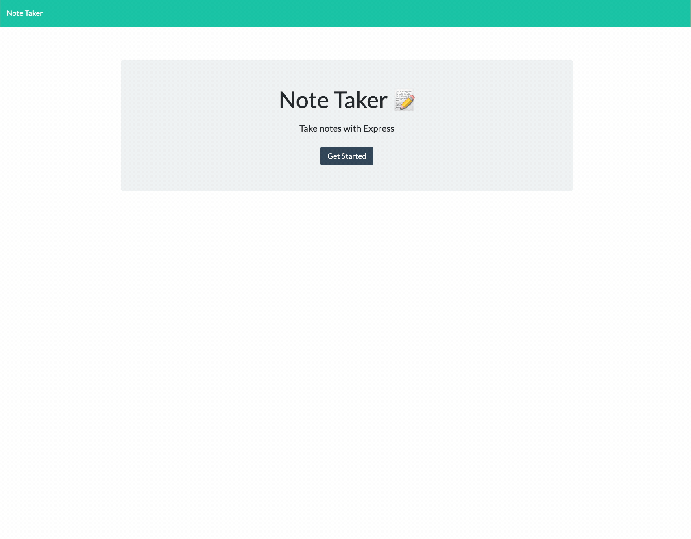

# Module 11 - Note Taker

<h1 align="center">
    <a href="https://agile-island-43684.herokuapp.com/" target="_blank">
     View Demo
    </a>
</h1>
<div align="center">
    
</div>

## Table of Contents

- [About](#about)
- [Getting Started](#getting_started)
- [Contributing](./CONTRIBUTING.md)
- [License](./LICENSE)
- [Code of Conduct](./CODE_OF_CONDUCT.md)
- [Theme](#theme)

## About <a name = "about"></a>

This is a [node](https://nodejs.org/en/) application that allows you to create, read, update, and delete notes. It uses [express](https://expressjs.com/) as the backend to handle requests from a JSON file. The frontend code was provided by the module.

## Getting Started <a name = "getting_started"></a>

### User Story

```
AS A small business owner
I WANT to be able to write and save notes
SO THAT I can organize my thoughts and keep track of tasks I need to complete
```

### Acceptance Criteria

```
GIVEN a note-taking application
WHEN I open the Note Taker
THEN I am presented with a landing page with a link to a notes page
WHEN I click on the link to the notes page
THEN I am presented with a page with existing notes listed in the left-hand column, plus empty fields to enter a new note title and the note’s text in the right-hand column
WHEN I enter a new note title and the note’s text
THEN a Save icon appears in the navigation at the top of the page
WHEN I click on the Save icon
THEN the new note I have entered is saved and appears in the left-hand column with the other existing notes
WHEN I click on an existing note in the list in the left-hand column
THEN that note appears in the right-hand column
WHEN I click on the Write icon in the navigation at the top of the page
THEN I am presented with empty fields to enter a new note title and the note’s text in the right-hand column
```

### Prerequisites

- [Node.js](https://nodejs.org/en/)
- [Express.js](https://expressjs.com/)

### Installing

1. Clone this repo.
2. Navigate to repo folder.
3. Run `node server.js`
4. Open a new tab in your browser and navigate to http://localhost:3001

## Theme <a name = "theme"></a>

- [Font](https://rubjo.github.io/victor-mono/)
- [Gruvbox Theme](https://github.com/morhetz/gruvbox)
